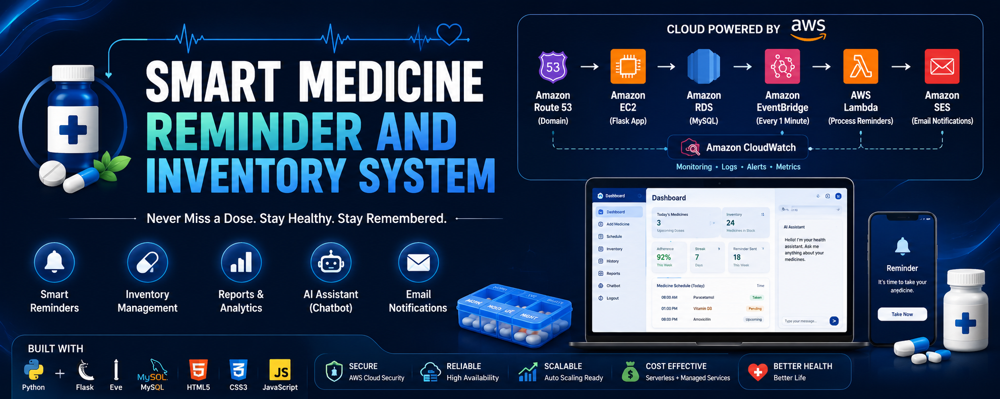
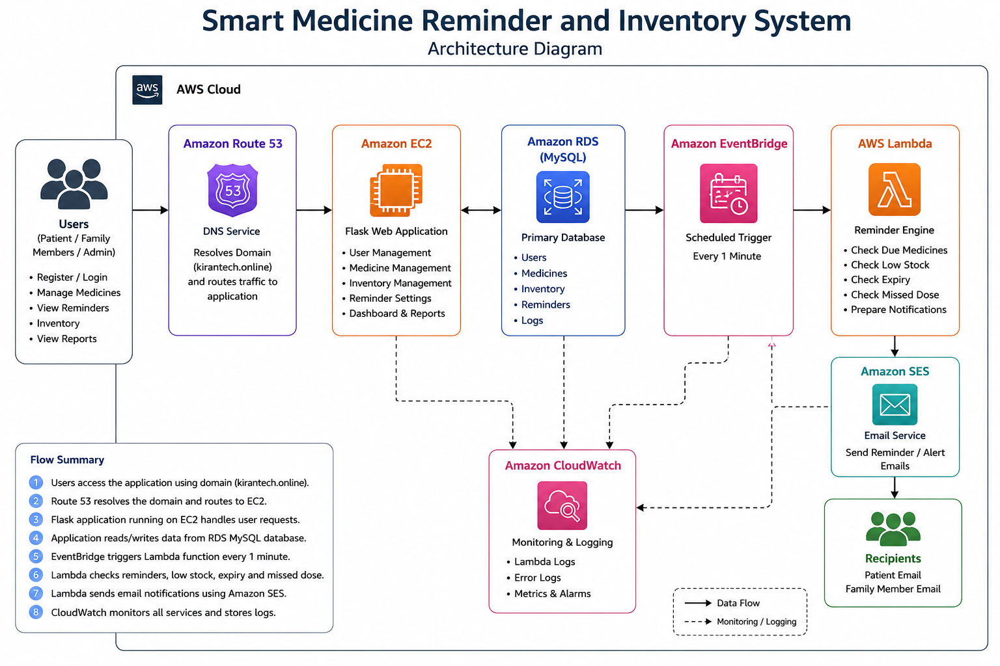
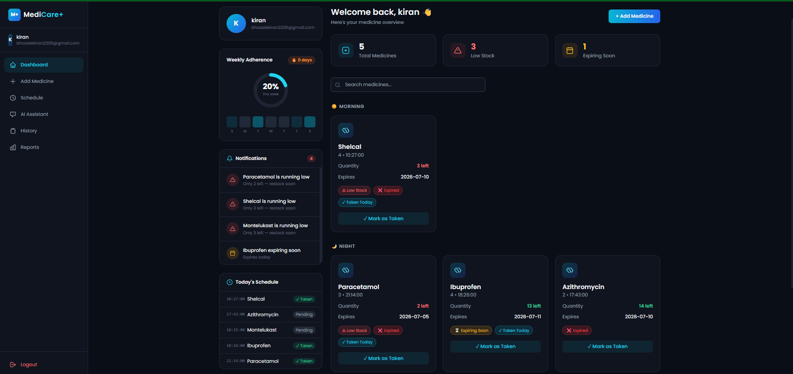
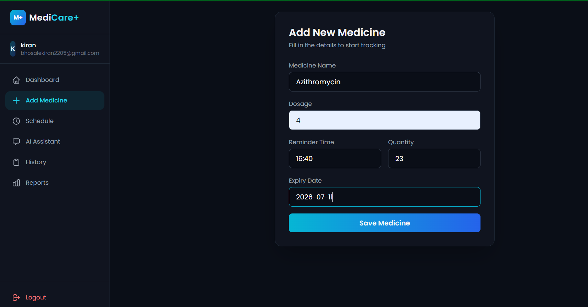
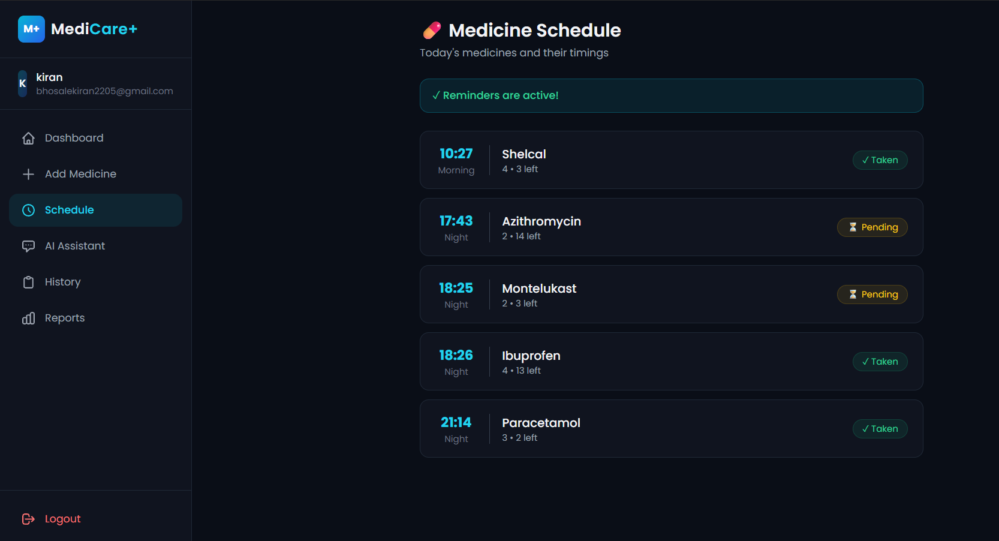
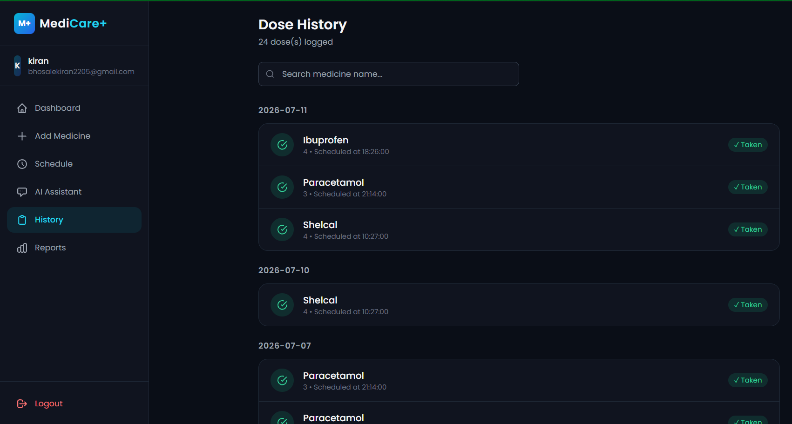
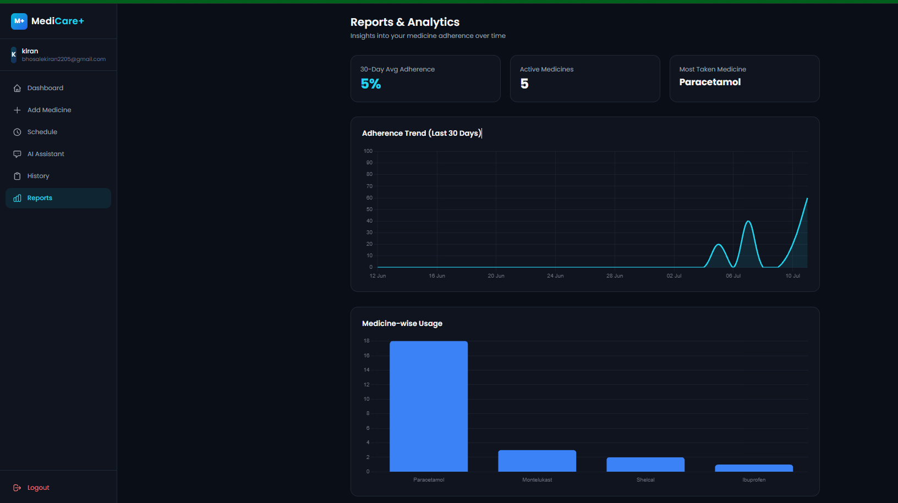
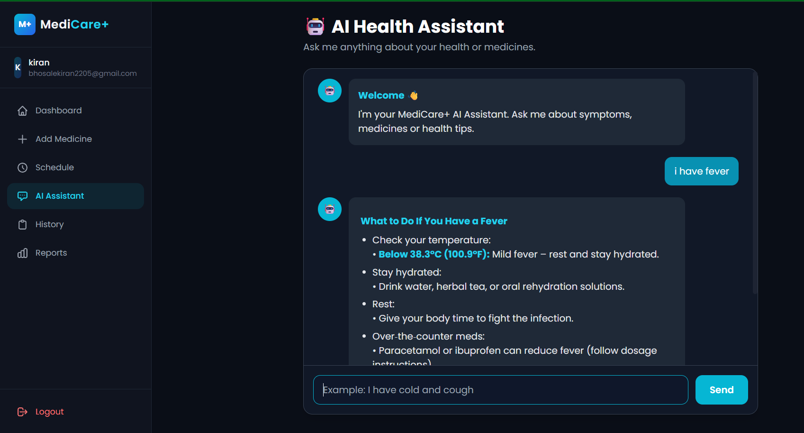

<p align="center">
  
</p>

<h1 align="center">💊 Smart Medicine Reminder And Inventory System</h1>

<p align="center">
An AI-powered medicine reminder and inventory management system built using Flask and AWS.

<br><br>


</p>


# 📖 Overview

The **Smart Medicine Reminder and Inventory System** is a cloud-based healthcare application developed using **Flask** and **Amazon Web Services (AWS)**.

The system helps users manage medicines efficiently by providing automated reminders, inventory management, expiry tracking, missed-dose monitoring, and email notifications.

The application is deployed on **Amazon EC2**, stores data in **Amazon RDS (MySQL)**, schedules reminder execution using **Amazon EventBridge** and **AWS Lambda**, sends reminder emails through **Amazon SES**, provides a custom domain using **Amazon Route 53**, and monitors the infrastructure using **Amazon CloudWatch

# ✨ Key Features

- 👤 User Registration & Login
- 💊 Medicine Inventory Management
- ⏰ Automated Medicine Reminders
- 📅 Medicine Schedule Management
- ⚠️ Missed Dose Detection
- 📦 Low Stock Monitoring
- 📧 Email Notifications using Amazon SES
- ☁️ Cloud Deployment on AWS
- 📊 CloudWatch Monitoring
- 🌐 Custom Domain with Amazon Route 53

---

# 🏗️ AWS Architecture


<p align="center">
  
</p>

### Architecture Workflow

```
User
   │
   ▼
Amazon Route 53
   │
   ▼
Amazon EC2 (Flask Application)
   │
   ▼
Amazon RDS (MySQL Database)
   │
   ├────────────► Amazon CloudWatch (Logs & Monitoring)
   │
   ▼
Amazon EventBridge
   │
   ▼
AWS Lambda (Reminder Service)
   │
   ▼
Amazon SES (Email Notifications)
```
Amazon CloudWatch continuously monitors the application's logs and performance.

> 📌 **Architecture Diagram**


---

# ☁️ AWS Services Used

| AWS Service | Purpose |
|-------------|----------|
| Amazon EC2 | Hosts the Flask web application |
| Amazon RDS (MySQL) | Stores users, medicines, reminders, and logs |
| Amazon EventBridge | Triggers reminder execution every minute |
| AWS Lambda | Processes medicine reminders |
| Amazon SES | Sends reminder and missed-dose emails |
| Amazon Route 53 | Provides custom domain routing |
| Amazon CloudWatch | Monitoring, metrics, and logs |

---

# 🛠️ Technology Stack

| Category | Technologies |
|-----------|--------------|
| Frontend | HTML5, CSS3, JavaScript |
| Backend | Python, Flask |
| Database | MySQL (Amazon RDS) |
| Cloud Platform | Amazon Web Services (AWS) |
| Email Service | Amazon SES |
| Scheduling | Amazon EventBridge + AWS Lambda |
| Monitoring | Amazon CloudWatch |
| DNS | Amazon Route 53 |
| Version Control | Git & GitHub |

---

# 📂 Project Structure

```
Smart-Medicine-Reminder-And-Inventory-System
│
├── static/
│   ├── css/
│   ├── images/
│   └── js/
│
├── templates/
│   ├── add_medicine.html
│   ├── base.html
│   ├── chatbot.html
│   ├── dashboard.html
│   ├── history.html
│   ├── landing.html
│   ├── login.html
│   ├── register.html
│   ├── reports.html
│   └── schedule.html
│
├── database/
├── docs/
├── Lambda/
├── screenshots/
│
├── app.py
├── requirements.txt
├── README.md
└── LICENSE
```
---

# ⚙️ Installation Guide

### Clone the Repository

```bash
git clone https://github.com/bhosalekiran2205-glitch/Smart-Medicine-Reminder-And-Inventory-System.git
```

### Move into the Project Folder

```bash
cd Smart-Medicine-Reminder-And-Inventory-System
```

### Create Virtual Environment

```bash
python -m venv venv
```

### Activate Virtual Environment

Windows

```bash
venv\Scripts\activate
```

Linux / macOS

```bash
source venv/bin/activate
```

### Install Dependencies

```bash
pip install -r requirements.txt
```

### Run the Flask Application

```bash
python app.py
---

# ☁️ AWS Deployment

The application is deployed on Amazon Web Services (AWS) using the following architecture:

- Amazon EC2 hosts the Flask application.
- Amazon RDS stores application data.
- Amazon EventBridge triggers AWS Lambda every minute.
- AWS Lambda processes reminder events.
- Amazon SES sends reminder emails.
- Amazon Route 53 provides the custom domain.
- Amazon CloudWatch monitors application health and logs.

---

---

---

# 📸 Application Screenshots

| Page | Screenshot |
|------|------------|
| Landing Page |  |
| Login Page |  |
| Register Page |  |
| Dashboard |  |
| Add Medicine |  |
| Schedule |  |
| History |  |
| Reports |  |
| Chatbot |  |

---

# ☁️ AWS Services Screenshots

| AWS Service | Screenshot |
|-------------|------------|
| Amazon Route 53 |  |
| Amazon EC2 |  |
| Amazon RDS |  |
| Amazon EventBridge |  |
| AWS Lambda |  |
| Amazon SES |  |
| Amazon CloudWatch |  |
# 🔮 Future Enhancements

- SMS Notifications
- Mobile Application
- AI-based Medicine Recommendation
- Voice Assistant Integration
- Family Member Dashboard
- Wearable Device Integration
- Medicine Barcode Scanner
- Multi-language Support

---

# 👩‍💻 Author

**Kiran Bhosale**

Bachelor of Computer Applications (BCA)

Cloud & Full Stack Developer

GitHub:
https://github.com/bhosalekiran2205-glitch

---

# 📄 License

This project is licensed under the MIT License.
